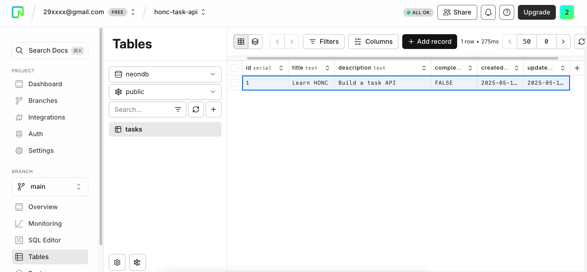

# HONC Task API Example 📝

**A step-by-step example guide to building a Serverless Task API using the HONC Stack (Hono, Drizzle ORM, Neon, and Cloudflare Workers).**

This repository accompanies the guide [**Getting Started with the HONC Stack**](http://neon.tech/guides/honc). It provides a practical example of how to integrate [Hono](https://hono.dev/) (a small, simple, and ultrafast web framework), [Drizzle ORM](https://orm.drizzle.team/) (a TypeScript ORM), [Neon](https://neon.tech/) (a serverless Postgres platform), and [Cloudflare Workers](https://workers.cloudflare.com/) to build efficient edge APIs.

In this example, you'll learn how to build a Task Management API that allows for creating, reading, updating, and deleting tasks. We'll walk through setting up the project, defining the database schema, creating API endpoints, and deploying the application.

## ✨ What you will build

This example will show you how to:

*   **Set up a HONC project:** Initialize a new project using `create-honc-app`.
*   **Define a database schema:** Use Drizzle ORM to define a `tasks` table in your Neon Postgres database.
*   **Create RESTful API endpoints:** Build CRUD operations for tasks using Hono.
*   **Implement input validation:** Utilize Zod for validating API request data.
*   **Generate OpenAPI documentation:** Automatically create an OpenAPI spec for your API.
*   **Test with an interactive playground:** Use the integrated Fiberplane API Playground.
*   **Deploy to the edge:** Deploy your serverless API to Cloudflare Workers.

## 🚀 Get started

### Prerequisites

Before you begin, make sure you have the following:

1.  **Node.js:** Version `22.15` or later installed. Download from [nodejs.org](https://nodejs.org/).
2.  **npm:** Comes with Node.js.
3.  **Neon Account:** A free Neon account. Sign up at [neon.tech](https://console.neon.tech/signup).
4.  **Cloudflare Account:** A free Cloudflare account for deployment. Sign up at [Cloudflare](https://dash.cloudflare.com/sign-up).
5.  **Wrangler CLI (Optional but Recommended for manual deployment):** Cloudflare's CLI. Install via `npm install -g wrangler`.

### Installation and Setup

1.  **Clone this repository:**
    ```bash
    git clone https://github.com/neondatabase-labs/honc-example
    cd honc-example
    ```

2.  **Install dependencies:**
    ```bash
    npm install
    ```

3.  **Configure Environment Variables (Neon Database):**
    *   If you haven't already, create a new project on [Neon](https://console.neon.tech) and get your database connection string.
    *   Copy the example environment file:
        ```bash
        cp .dev.vars.example .dev.vars
        ```
    *   Open the `.dev.vars` file and add your Neon database connection string:
        ```ini
        DATABASE_URL="YOUR_NEON_CONNECTION_STRING"
        ```
        Replace `YOUR_NEON_CONNECTION_STRING` with your actual connection string. This file is used by Wrangler for local development.

4.  **Database Migrations:**
    Apply the database schema to your Neon database. This will create the `tasks` table.
    ```bash
    npm run db:migrate
    ```
    If you make changes to `src/db/schema.ts` in the future, you'll need to generate new migrations first with `npm run db:generate` before running `npm run db:migrate`.

### Run the Example Locally

Start the development server using Wrangler:

```bash
npm run dev
```

Your API will typically be available at `http://localhost:8787`.

You can interact with your API using:
*   **Fiberplane API Playground:** Navigate to `http://localhost:8787/fp` in your browser for an interactive testing experience.
    
*   **cURL or API Clients (Postman, Insomnia):**
    *   **List all tasks:** `curl http://localhost:8787/api/tasks`
    *   **Create a task:**
        ```bash
        curl -X POST -H "Content-Type: application/json" -d '{"title":"Buy groceries","description":"Milk, eggs, bread"}' http://localhost:8787/api/tasks
        ```
*   **OpenAPI Specification:** View the raw spec at `http://localhost:8787/openapi.json`.

**Expected Interaction:**

When you run `npm run dev` and access `http://localhost:8787/fp`, you should see the Fiberplane API Playground allowing you to send requests to your defined `/api/tasks` endpoints. Creating a task should return the task object with an ID, and listing tasks should show any created tasks.

You can also check your Neon console to see the `tasks` table and any data inserted.


## ☁️ Deployment to Cloudflare Workers

1.  **Set `DATABASE_URL` Secret in Cloudflare:**
    Your deployed Worker needs access to the Neon database connection string.
    ```bash
    npx wrangler secret put DATABASE_URL
    ```
    Paste your Neon connection string when prompted.

2.  **Deploy:**
    Ensure your `wrangler.toml` has a unique `name` for your worker.
    ```bash
    npm run deploy
    ```
    After deployment, Wrangler will output the URL of your live API (e.g., `https://your-worker-name.your-cloudflare-subdomain.workers.dev`).

## 📜 Project Structure Overview

*   `src/index.ts`: Main Hono application file, defines API routes, Zod schemas, and OpenAPI/Fiberplane setup.
*   `src/db/schema.ts`: Drizzle ORM schema definition for the `tasks` table.
*   `drizzle/`: Directory containing auto-generated database migration files.
*   `wrangler.toml`: Configuration file for Cloudflare Workers.
*   `.dev.vars`: Local environment variables (gitignored), primarily for `DATABASE_URL`.
*   `package.json`: Project dependencies and scripts.
*   `drizzle.config.ts`: Configuration for Drizzle Kit (migration tool).

## Resources

*   **HONC Guide:** [Getting Started with the HONC Stack (YOUR_BLOG_POST_URL_HERE)](YOUR_BLOG_POST_URL_HERE)
*   **Hono:** [hono.dev](https://hono.dev/)
*   **Drizzle ORM:** [orm.drizzle.team](https://orm.drizzle.team/)
*   **Neon:** [neon.tech/docs](https://neon.tech/docs/)
*   **Cloudflare Workers:** [developers.cloudflare.com/workers/](https://developers.cloudflare.com/workers/)
*   **Fiberplane API Playground for Hono:** [Fiberplane Blog](https://fiberplane.com/blog/hono-native-playground/)
*   **`create-honc-app` CLI:** [GitHub](https://github.com/fiberplane/create-honc-app)

## 🤝 Contributing

Contributions are welcome! If you have suggestions for improvements or find any issues, please feel free to open an issue or submit a pull request.
